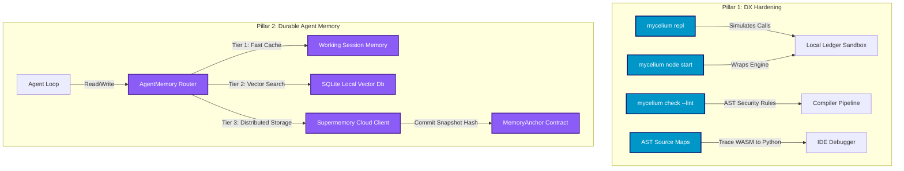

# Mycelium Road Ahead: Implementation Plan (Pillars 1 & 2)

This document maps out the detailed execution strategy, API designs, and code structures for building out **Pillar 1 (Developer Tooling & DX Hardening)** and **Pillar 2 (Durable Agent Memory)**.

---

## 🗺️ Architectural Roadmap



---

## 🛠️ Pillar 1: Developer Tooling & DX Hardening

### 1. Local Ledger Node Wrapper (`mycelium node start`)
The local node runner wraps the Dockerized `stellar/quickstart` image or local binary, bootstrapping a single-validator standalone sandbox ledger.

* **CLI Syntax**:
  ```bash
  mycelium node start [--port 8000] [--friendbot-limit 10000] [--docker-tag latest]
  ```
* **Underlying Logic**:
  - Detects if `docker` is installed. If so, spins up:
    ```bash
    docker run --rm -p 8000:8000 --name mycelium-sandbox-node stellar/quickstart --local --enable-soroban-rpc
    ```
  - Exposes local Friendbot faucet endpoint automatically at `http://localhost:8000/friendbot`.
  - Configures the local configuration context inside `.mycelium/config.toml` to point to `http://localhost:8000/soroban/rpc`.

### 2. Interactive Contract REPL (`mycelium repl`)
Allows developers to load a compiled contract in-memory and execute calls against a mock ledger state interactively.

* **REPL Design & Commands**:
  - Starts an interactive Python shell shell (using `code.InteractiveConsole`) loaded with context helpers.
  - Pre-loads default wallets and compiled WASM functions.
  ```python
  # Example REPL interaction:
  >>> contract = load_contract("build/contract.wasm")
  >>> contract.init(admin="GB...")
  >>> contract.get_counter()
  0
  >>> contract.increment()
  >>> contract.get_counter()
  1
  >>> state.inspect_storage()  # Prints raw ledger state mapping
  {"counter": 1}
  ```

### 3. Static Security Linter (`mycelium check --lint`)
Parsed abstract syntax trees (ASTs) are analyzed for known vulnerability signatures before compiling to WASM.

* **Linting Rules Registry**:
  1. **Authorization Check Omissions (`MCL001`)**: Identifies functions decorated with `@external` that write to `@storage` but do not call `auth()` on caller addresses.
  2. **Reentrancy Risk (`MCL002`)**: Detects contract calls made *before* modifying local storage keys (violating the Checks-Effects-Interactions pattern).
  3. **Unchecked Arithmetic Bounds (`MCL003`)**: Flags unchecked integer divisions or potential overflows when manipulating primitive `u32`/`i32`/`u64` integers outside DSL safe types.

### 4. AST Source Maps
Generates mapping metadata linking compiled WebAssembly bytecodes to Python AST nodes.

* **Implementation Details**:
  - During transpilation, the compiler creates a `contract.wasm.map` JSON containing lines and character mappings from `contract.py` through generated Rust source down to WASM instructions.
  - Connects to the Web IDE debugger so that exception stack traces or execution steps in the Monaco editor highlight the actual Python DSL lines instead of bytecode offsets.

### 5. Agent Templates Library
Extends CLI project scaffolding with complete multi-agent templates.

* **Templates Specs**:
  - `mycelium init --template arbitrage`: Generates multi-asset price monitor, DEX swap execution tools, and native swap contracts.
  - `mycelium init --template swarm-dao`: Generates vote-counting contracts, multi-sig approval routers, and agent loop assignees.

---

## 🧠 Pillar 2: Durable Agent Memory (Supermemory)

### 1. Tiered Memory Router (`AgentMemory`)
Episodic facts and vectors are categorized into three retrieval tiers depending on speed and gas cost.

```
       Working Memory (In-process dict)   ───► Fast, ephemeral
                  │
                  ▼
       Local Semantic Memory (SQLite VSS)  ───► Local disk, vector embeddings
                  │
                  ▼
       Remote Anchored Memory (Supermemory) ───► Cloud vector, on-chain verified
```

### 2. Zero-Dependency Local Fallback (SQLite + Embeddings)
For offline local development, we integrate SQLite VSS (Vector Search Extension) alongside local CPU-bound embedding helpers (e.g. `sentence-transformers` or local API client hooks).

* **Database Schema (`~/.mycelium/memory.db`)**:
  ```sql
  CREATE TABLE IF NOT EXISTS semantic_memory (
      id TEXT PRIMARY KEY,
      content TEXT NOT NULL,
      embedding F32_BLOB NOT NULL,
      metadata TEXT,
      created_at TIMESTAMP DEFAULT CURRENT_TIMESTAMP
  );
  CREATE INDEX IF NOT EXISTS idx_memory_created ON semantic_memory(created_at);
  ```

### 3. Supermemory Cloud Integration
Supermemory acts as the cloud database engine. The agent's Stellar G-address serves as the authentication and collection partition token.

* **API Client Interface**:
  - Sends document chunking and vector calculations to the Supermemory container.
  - Syncs facts to the cloud database using:
    ```bash
    POST /api/memory/sync
    Headers: Authorization: Bearer <agent_signature_token>
    Body: { "containerTag": "<agent_public_key>", "chunks": [...] }
    ```

### 4. Verifiable Memory Anchoring
Once local/cloud memory is dirty and reaches a commit policy limit (e.g., end of task or 10 writes), the agent commits the state root on-chain.

* **Commit Routine**:
  1. Calculate `SHA-256` hash of the full JSON fact bundle: `memory_root = SHA256(JSON)`.
  2. Invoke `set_anchor(memory_root, uri, acl)` on the on-chain `MemoryAnchor` contract.
  3. Returns the new monotonic `version` index. Sibling agents can verify memory state by retrieving the URI, hashing the content, and asserting it matches `memory_root`.

---

## 📅 Phased Milestones & Execution Plan

### Milestone 1: Local node & REPL (Duration: 2 weeks)
- [ ] Add the `mycelium node` commands group using docker-py library interface.
- [ ] Wire the interactive Python Console REPL and state inspectors inside the CLI.
- [ ] Build default project template presets for the REPL environment.

### Milestone 2: Linter & Source Maps (Duration: 3 weeks)
- [ ] Implement AST visitor checks in `mycelium_compiler/validator.py` for rules `MCL001` (auth), `MCL002` (reentrancy), and `MCL003` (math).
- [ ] Map compiler line numbers to emitted WASM instructions.
- [ ] Integrate linter output warnings into the `mycelium check` command.

### Milestone 3: Tiered Memory & Local SQLite (Duration: 2 weeks)
- [ ] Write the `AgentMemory` router client inside `sdk/mycelium_sdk/memory/`.
- [ ] Implement local SQLite database creation and cosine similarity lookup helpers.
- [ ] Integrate local memory search as tool inputs inside the agent loop.

### Milestone 4: Cloud Supermemory & Anchoring (Duration: 3 weeks)
- [ ] Implement the HTTP client for Supermemory syncing and token creation.
- [ ] Author and deploy the `MemoryAnchor` contract with tests in `sdk/tests/test_memory.py`.
- [ ] Enable automatic on-chain committing on task completion in `run_agent_loop`.
